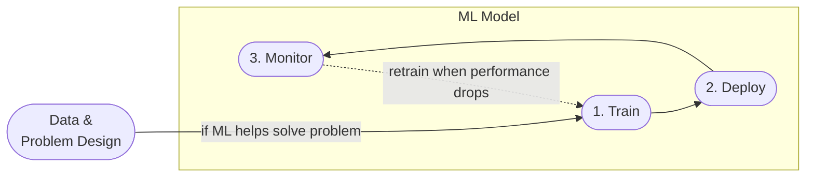

Code:

Recommended development environment: Linux

### Step 1: Download and install the Anaconda distribution of Python
```sh
wget https://repo.anaconda.com/archive/Anaconda3-2022.05-Linux-x86_64.sh
bash Anaconda3-2022.05-Linux-x86_64.sh
```

### Step 2: Update existing packages

```sh
sudo apt update
```

### Step 3: Install Docker

```sh
sudo apt install docker.io
```

To run docker without `sudo`:

```sh
sudo groupadd docker
sudo usermod -aG docker $USER
```

### Step 4: Install Docker Compose

Install docker-compose in a separate directory

```sh
mkdir soft
cd soft
```

To get the latest release of Docker Compose, go to https://github.com/docker/compose and download the release for your OS.

```sh
wget https://github.com/docker/compose/releases/download/v2.6.1/docker-compose-linux-x86_64 -O docker-compose
```

Make it executable

```sh
chmod +x docker-compose
```

Add to the `soft` directory to `PATH`. Open the `.bashrc` file with `nano`:

```sh
nano ~/.bashrc
```

In `.bashrc`, add the following line:

```bash
export PATH="${HOME}/soft:${PATH}"
```

Save it and run the following to make sure the changes are applied:

```bash
source .bashrc
```


### Step 5: Run Docker

```sh
docker run hello-world
```

If you get `docker: Got permission denied while trying to connect to the Docker daemon socket at unix:///var/run/docker.sock: Post "http://%2Fvar%2Frun%2Fdocker.sock/v1.24/containers/create": dial unix /var/run/docker.sock: connect: permission denied.` error, restart your VM instance. 


**Note**: If you get `It is required that your private key files are NOT accessible by others. This private key will be ignored.` error, you should change permits on the downloaded file to protect your private key:

 ```sh
chmod 400 name-of-your-private-key-file.pem
```

### Step 5: Run Docker

```sh
docker run hello-world
```

If you get `docker: Cannot connect to the Docker daemon at unix:///var/run/docker.sock. Is the docker daemon running?.` error, open another shell prompt your machine and execute

```sh
sudo  dockerd
```
then  in another reexcute in another shell prompt:

```sh
docker run hello-world
```


# 🗒 Week 1 Notes: What is MLOps?

When machine learning (ML) is used to solve a business problem, one could argue that delivering the model output to the end-user in a reliable way is an integral part of the machine learning process.

## 🔁 ML Model Life-Cycle
For a clearer picture, we can look at a life-cycle of a machine learning model:



* **Data & Problem Design**: Choose machine learning to solve a problem when there is no other more straightforward approach and the data has sufficient quality.
* 1️⃣ **Train**: Train and evaluate ML models and choose the best performing one.
* 2️⃣ **Deploy**: Integrate the chosen model into the production environment (web service, module, embedded system, etc.)
* 3️⃣ **Monitor**: Capture the model's performance in the production environment and define a threshold for an acceptable value.


Depending on the use case, team skills, and established best practices, each of the life-cycle stages could be realized manually or with more automation support. MLOps is a practice that could support the maturity of the life-cycle iterations.


## ⚙️ Machine Learning Operations (MLOps)

MLOps brings DevOps principles to machine learning. It is a set of best practices to put ML models into production and automate the life-cycle.

MLOps could help to
* track model iterations and reproduce results reliably,
* monitor model performance and deliver domain-specific metrics for ML,
* and deliver models safely and automatically into production.


## 📈 MLOps Maturity Model

The extent to which MLOps is implemented into a team or organization could be expressed as maturity. A framework for classifying different levels of MLOps maturity is listed below:


| Lvl |              | Overview | 
|----:|--------------|----------| 
| 0️⃣  | **No MLOps** | <ul><li>ML process highly manual</li><li>poor cooperation</li><li>lack of standards, success depends on an individual's expertise</li> </ul> | 
| 1️⃣  | **DevOps but no MLOps** | <ul><li>ML training is most often manual </li><li>software engineers might help with the deployment</li><li>automated tests and releases</li> </ul> | 
| 2️⃣  | **Automated Training** | <ul><li>ML experiment results are centrally tracked </li><li>training code and models are version controlled</li><li>deployment is handled by software engineers</li> </ul> | 
| 3️⃣  | **Automated Model Deployment** | <ul><li>releases are managed by an automated CI/CD pipeline</li><li>close cooperation between data and software engineers</li><li>performance of the deployed model is monitored, A/B tests for model selection are used</li></ul> | 
| 4️⃣  | **Full MLOps Automated Operations** | <ul><li>clearly defined metrics for model monitoring</li><li>automatic retraining triggered when passing a model metric's threshold</li> </ul>  |


more on maturity, visit [Microsoft's MLOps maturity model](https://docs.microsoft.com/en-us/azure/architecture/example-scenario/mlops/mlops-maturity-model).


